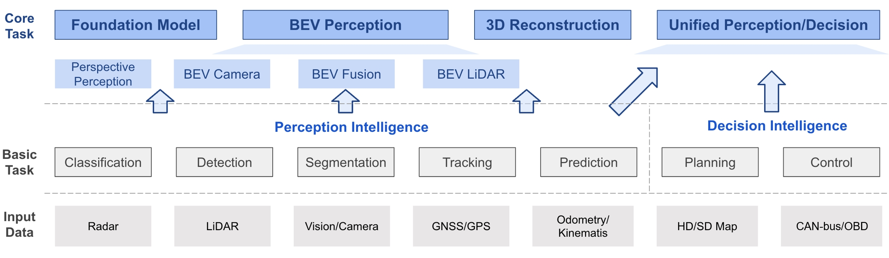

# Bird's-eye-view (BEV) Perception: A Survey and Collection

Awesome BEV perception papers and toolbox for achieving state-of-the-arts performance.

### Table of Contents
- [Introduction](#introduction)
  - [Major Features](#major-features)
- [What's New](#whats-new)
- [BEV Algorithm Family](#bev-algorithm-family)
- [BEV Toolbox](#bev-toolbox)
- [Literature Survey](#literature-survey)
- [License and Citation](#license-and-citation)


## Introduction

This repo is associated with the survey paper "[Delving into the Devils of Bird’s-eye-view Perception: A Review, Evaluation and Recipe](https://ieeexplore.ieee.org/document/10321736)", which provides an up-to-date literature survey for BEV perception and an open-source BEV toolbox based on PyTorch. We also introduce the BEV algorithm family, including follow-up work on BEV percepton such as [VCD](https://arxiv.org/abs/2310.15670), [GAPretrain](https://arxiv.org/abs/2304.03105), and [FocalDistiller](https://openaccess.thecvf.com/content/CVPR2023/html/Zeng_Distilling_Focal_Knowledge_From_Imperfect_Expert_for_3D_Object_Detection_CVPR_2023_paper.html). We hope this repo can not only be a good starting point for new beginners but also help current researchers in the BEV perception community.
<!-- In the literature survey, it includes different modalities (camera, lidar and fusion) and tasks (detection and segmentation). As for the toolbox, it provides useful recipe for BEV camera-based 3D object detection, including solid data augmentation strategies, efficient BEV encoder design, loss function family, useful test-time augmentation, ensemble policy, and so on. -->

`If you find some work popular enough to be cited below, email us or simply open a PR!`

<!-- Currently, the BEV perception community is very active and growing fast. There are also some good repos of BEV Perception, _e.g_. -->

<!-- * [BEVFormer](https://github.com/fundamentalvision/BEVFormer) . A cutting-edge baseline for camera-based detection via spatiotemporal transformers.
* [BEVDet](https://github.com/HuangJunJie2017/BEVDet) . Official codes for the camera-based detection methods - BEVDet series, including BEVDet, BEVDet4D and BEVPoolv2.
* [PETR](https://github.com/megvii-research/PETR) . Implicit BEV representation for camera-based detection and Segmentation, including PETR and PETRv2.
* [BEVDepth](https://github.com/Megvii-BaseDetection/BEVDepth) . Official codes for the BEVDepth and BEVStereo, which use LiDAR or temporal stereo to enhance depth estimation.
* [Lift-splat-shoot](https://github.com/nv-tlabs/lift-splat-shoot) . Implicitly Unprojecting camera image features to 3D for the segmentation task. 
* [BEVFusion (MIT)](https://github.com/mit-han-lab/bevfusion) . Unifies camera and LiDAR features in the shared bird's-eye view (BEV) representation space for the detection and map segmentation tasks.
* [BEVFusion (ADLab)](https://github.com/ADLab-AutoDrive/BEVFusion) . A simple and robust LiDAR-Camera fusion framework for the detection task.  -->

### Major Features

* **Up-to-date Literature Survey for BEV Perception** <br> We summarize important methods in recent years about BEV perception, including different modalities (camera, LIDAR, Fusion) and tasks (Detection, Segmentation, Occupancy). More details of the survey paper list can be found [here](./docs/paper_list/).

* **Convenient BEVPerception Toolbox** <br> We integrate a bag of tricks in the BEV toolbox that helps us achieve 1st in the camera-based detection track of the Waymo Open Challenge 2022, which can be used independently or as a plug-in for popular deep learning libraries. Moreover, we provide a suitable playground for beginners in this area, including a hands-on tutorial and a small-scale dataset (1/5 WOD in kitti format) to validate ideas. More details can be found [here](./bev_toolbox/README.md).

* **SOTA BEV Knowledge Distillation Algorithms** <br> We include important follow-up works of BEVFormer/BEVDepth/SOLOFusion in the perspective of knowledge distillation([VCD](https://arxiv.org/abs/2310.15670), [GAPretrain](https://arxiv.org/abs/2304.03105), [FocalDistiller](https://openaccess.thecvf.com/content/CVPR2023/html/Zeng_Distilling_Focal_Knowledge_From_Imperfect_Expert_for_3D_Object_Detection_CVPR_2023_paper.html)). More details of each paper can be found in each README.md file under [here](./nuScenes_playground/).

| Method | Expert | Apprentice |
| :---: | :---: | :---: |
| VCD | Vision-centric multi-modal detector | Camera-only detector |
| GAPretrain  | Lidar-only detector  | Camera-only detector  |
| FocalDistiller   | Camera-only detector  | Camera-only detector  |

## What's New
```2023/11/04``` Our Survey is accepted by IEEE T-PAMI.

```2023/10/26``` A new paper [VCD](https://arxiv.org/abs/2310.15670) is coming soon with official implementation.

```2023/09/06``` We have a new version of the [survey](https://ieeexplore.ieee.org/document/10321736). Check it out!

```2023/04/06``` Two new papers [GAPretrain](https://arxiv.org/abs/2304.03105) and [FocalDistiller](https://openaccess.thecvf.com/content/CVPR2023/html/Zeng_Distilling_Focal_Knowledge_From_Imperfect_Expert_for_3D_Object_Detection_CVPR_2023_paper.html) are coming soon with official implementation.

```2022/10/13``` v0.1 was released.
* Integrate some practical data augmentation methods for BEV camera-based 3D detection in the toolbox.
* Offer a pipeline to process the Waymo dataset (camera-based 3D detection).
* Release a baseline (with config) for the Waymo dataset and also 1/5 of the Waymo dataset in Kitti format.

## Literature Survey


The general picture of BEV perception at a glance, where consists of three sub-parts based on the input modality. BEV perception is a general task built on top of a series of fundamental tasks. For better completeness of the whole perception algorithms in autonomous driving, we list other topics as well. More details can be found in the [survey paper](https://ieeexplore.ieee.org/document/10321736).

We have summarized important datasets and methods in recent years about BEV perception in academia and also different roadmaps used in industry. 
* [Academic Summary of BEV Perception](docs/paper_list/academia.md)
  * [Datasets for BEV Perception](docs/paper_list/dataset.md)
  * [BEV Camera](docs/paper_list/bev_camera.md)
  * [BEV Lidar](docs/paper_list/bev_lidar.md)
  * [BEV Fusion](docs/paper_list/bev_fusion.md)
* [Industrial Roadmap of BEV Perception](docs/paper_list/industry.md)
  
We have also summarized some conventional methods for different tasks.
* [Conventional Methods Camera 3D Object Detection](docs/paper_list/camera_detection.md)
* [Conventional Methods LiDAR Detection](docs/paper_list/lidar_detection.md)
* [Conventional Methods LiDAR Segmentation](docs/paper_list/lidar_segmentation.md)
* [Conventional Methods Sensor Fusion](docs/paper_list/sensor_fusion.md)

## BEV Toolbox
The BEV toolbox provides useful recipes for BEV camera-based 3D object detection, including solid data augmentation strategies, efficient BEV encoder design, loss function family, useful test-time augmentation, ensemble policy, and so on. Please refer to [bev_toolbox/README.md](bev_toolbox/README.md) for more details.

## BEV Knowledge Distillation Algorithms
The BEV algorithm family includes follow-up works of BEVFormer in different aspects, ranging from plug-and-play tricks to pre-training distillation. All paper summary is under [nuscenes_playground](nuScenes_playground) along with official implementation, check it out!
* **VCD (NeurIPS 2023)** <br> [Leveraging Vision-Centric Multi-Modal Expertise for 3D Object Detection](https://arxiv.org/abs/2310.15670). More details can be found in [nuScenes_playground/VCD](./nuScenes_playground/VCD/README.md).
* **GAPretrain (arXiv)** <br> [Geometric-aware Pretraining for Vision-centric 3D Object Detection](https://arxiv.org/abs/2304.03105). More details can be found in [nuScenes_playground/GAPretrain.md](./nuScenes_playground/GAPretrain.md).
* **FocalDistiller (CVPR 2023)** <br> [Distilling Focal Knowledge from Imperfect Expert for 3D object Detection](https://openaccess.thecvf.com/content/CVPR2023/html/Zeng_Distilling_Focal_Knowledge_From_Imperfect_Expert_for_3D_Object_Detection_CVPR_2023_paper.html). More details can be found in [nuScenes_playground/FocalDistiller](nuScenes_playground/FocalDistiller/README.md).


## License and Citation
This project is released under the [Apache 2.0 license](LICENSE).

If you find this project useful in your research, please consider cite:

```BibTeX
@article{li2022bevsurvey,
  author={Li, Hongyang and Sima, Chonghao and Dai, Jifeng and Wang, Wenhai and Lu, Lewei and Wang, Huijie and Zeng, Jia and Li, Zhiqi and Yang, Jiazhi and Deng, Hanming and Tian, Hao and Xie, Enze and Xie, Jiangwei and Chen, Li and Li, Tianyu and Li, Yang and Gao, Yulu and Jia, Xiaosong and Liu, Si and Shi, Jianping and Lin, Dahua and Qiao, Yu},
  journal={IEEE Transactions on Pattern Analysis and Machine Intelligence}, 
  title={Delving Into the Devils of Bird's-Eye-View Perception: A Review, Evaluation and Recipe}, 
  year={2023},
  volume={},
  number={},
  pages={1-20},
  doi={10.1109/TPAMI.2023.3333838}
}
```
```BibTeX
@misc{bevtoolbox2022,
  title={{BEVPerceptionx-Survey-Recipe} toolbox for general BEV perception},
  author={BEV-Toolbox Contributors},
  howpublished={\url{https://github.com/OpenDriveLab/Birds-eye-view-Perception}},
  year={2022}
}
```
