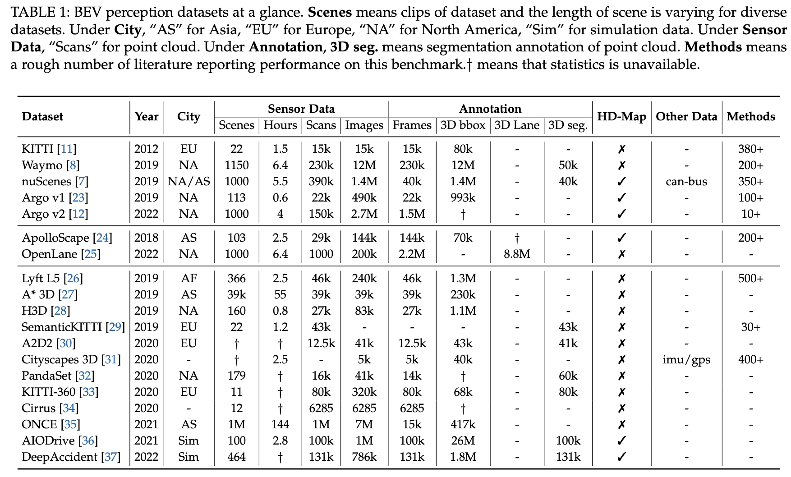
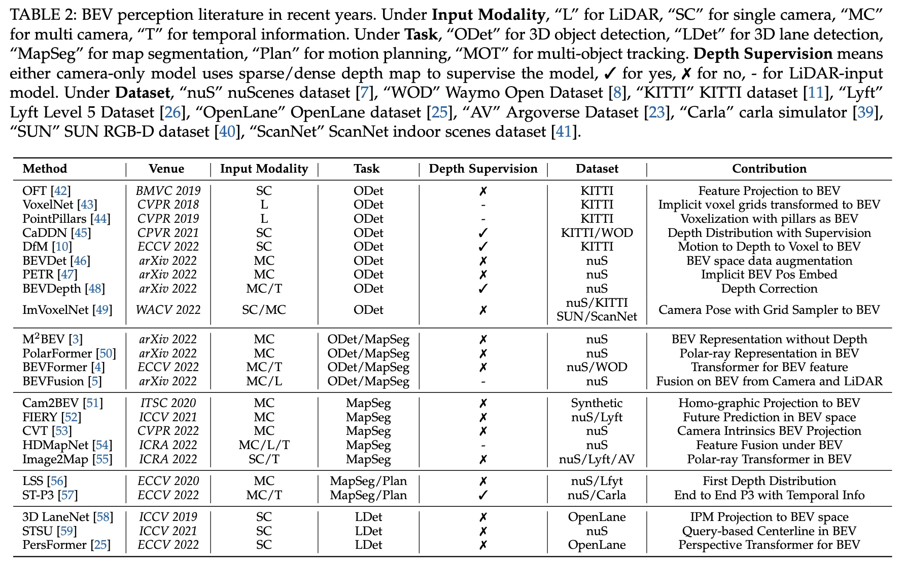
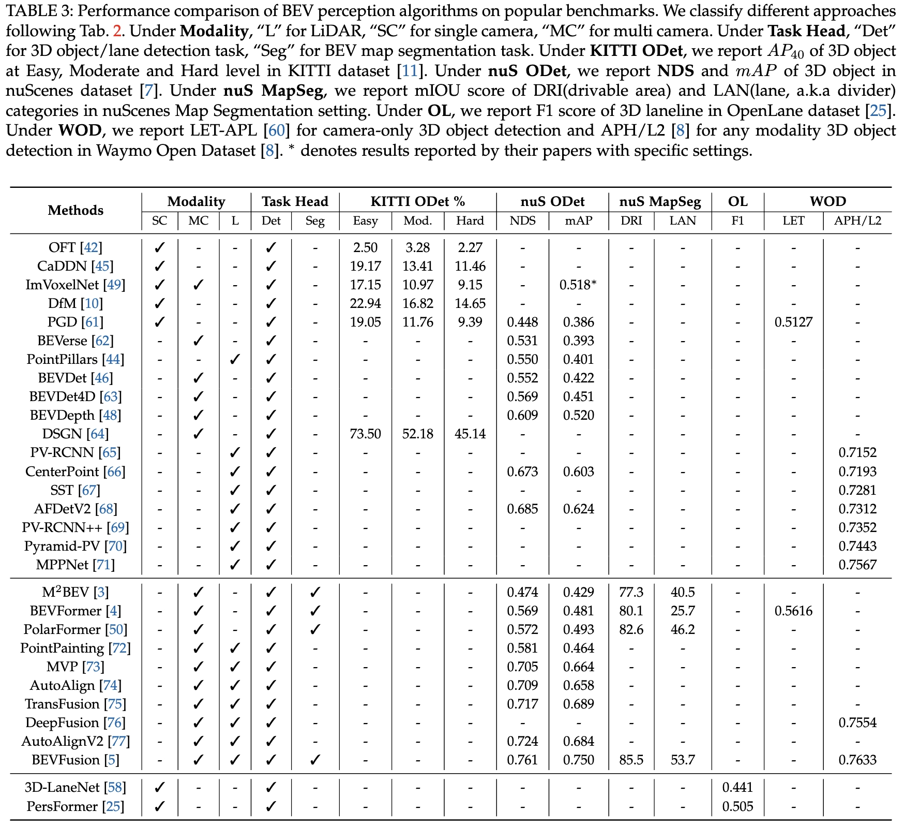
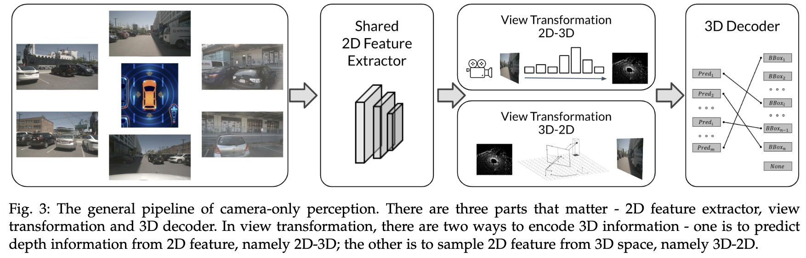
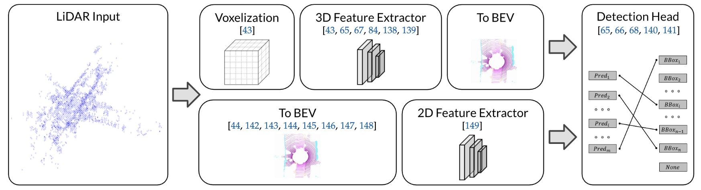
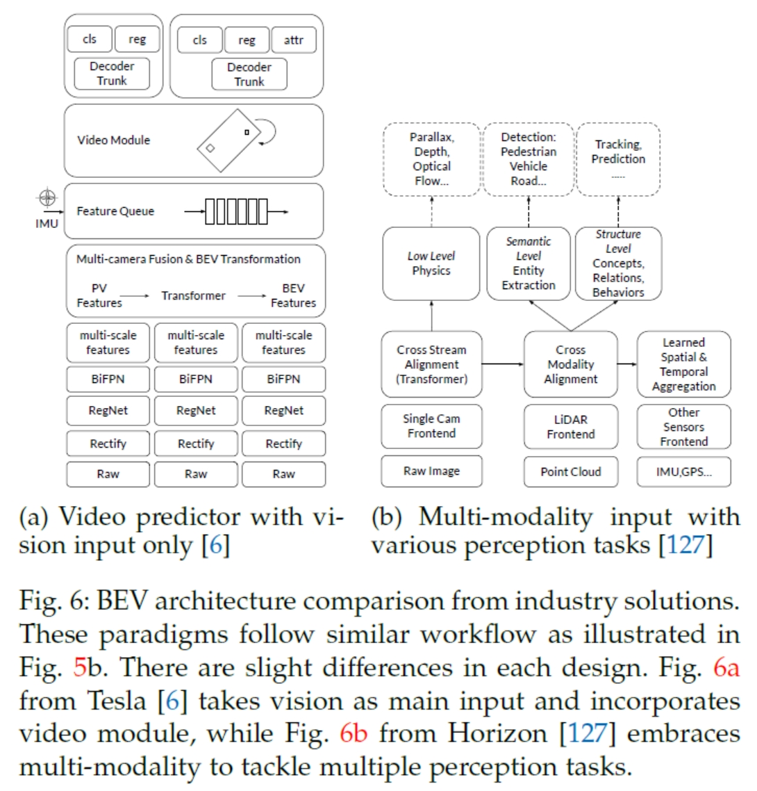
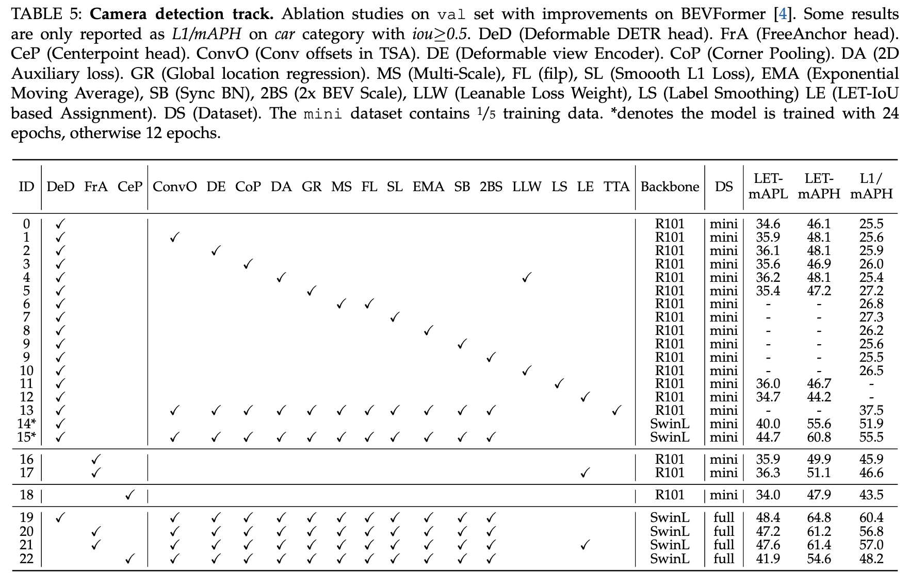
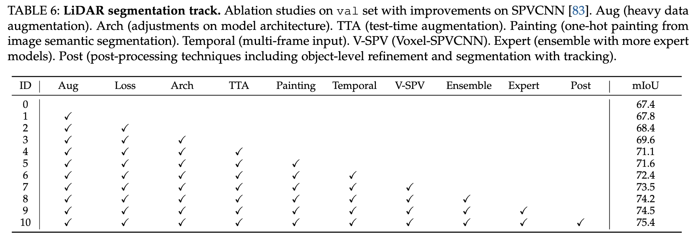

# BEVPerception-Survey-Recipe
Awesome BEV perception papers and cookbook for achieving SOTA results

## Overview of BEV Perception

The general picture of BEV perception at a glance, where consists of three sub-parts based on the input modality. BEV perception is a general task built on top of a series of fundamental tasks. For better completeness of the whole perception algorithms in autonomous driving, we list other topics as well.
## Datasets of BEV Perception

# WIP
## Academic Summary of BEV Perception
Important methods in recent years about BEV perception, including different modalities and tasks.

Important methods performance in recent years about BEV perception, including different settings and leaderboards.

### BEV Camera
A general pipeline in BEV Camera

And related literature.

- Lift, Splat, Shoot: Encoding Images from Arbitrary Camera Rigs by Implicitly Unprojecting to 3D / [paper](https://arxiv.org/pdf/2008.05711.pdf) / [project](https://github.com/nv-tlabs/lift-splat-shoot) / ECCV 2020 / LSS 
- BEVDet: High-performance Multi-camera 3D Object Detection in Bird-Eye-View / [paper](https://arxiv.org/pdf/2112.11790.pdf) / [project](https://github.com/HuangJunJie2017/BEVDet) / arXiv / BEVDet
- BEVDet4D: Exploit Temporal Cues in Multi-camera 3D Object Detection / [paper](https://arxiv.org/pdf/2203.17054.pdf) / [project](https://github.com/HuangJunJie2017/BEVDet) / arXiv / BEVDet4D
- BEVDepth: Acquisition of Reliable Depth for Multi-view 3D Object Detection / [paper](https://arxiv.org/pdf/2206.10092.pdf) / [project](https://github.com/Megvii-BaseDetection/BEVDepth) / arXiv / BEVDepth
- BEVFusion: Multi-Task Multi-Sensor Fusion with Unified Bird's-Eye View Representation / [paper](https://arxiv.org/pdf/2205.13542.pdf) / [project](https://github.com/mit-han-lab/bevfusion) / arXiv / BEVFusion
- BEVFusion: A Simple and Robust LiDAR-Camera Fusion Framework / [paper](https://arxiv.org/pdf/2205.13790.pdf) / [project](https://github.com/ADLab-AutoDrive/BEVFusion) / arXiv / BEVFusion
- DSGN: Deep Stereo Geometry Network for 3D Object Detection / [paper](https://openaccess.thecvf.com/content_CVPR_2020/papers/Chen_DSGN_Deep_Stereo_Geometry_Network_for_3D_Object_Detection_CVPR_2020_paper.pdf) / [supplemental](https://openaccess.thecvf.com/content_CVPR_2020/supplemental/Chen_DSGN_Deep_Stereo_CVPR_2020_supplemental.pdf) / [project](https://github.com/dvlab-research/DSGN) / CVPR 2020
- LIGA-Stereo: Learning LiDAR Geometry Aware Representations for Stereo-Based 3D Detector / [paper](https://openaccess.thecvf.com/content/ICCV2021/papers/Guo_LIGA-Stereo_Learning_LiDAR_Geometry_Aware_Representations_for_Stereo-Based_3D_Detector_ICCV_2021_paper.pdf) / [supplemental](https://openaccess.thecvf.com/content/ICCV2021/supplemental/Guo_LIGA-Stereo_Learning_LiDAR_ICCV_2021_supplemental.pdf) / [project](https://github.com/xy-guo/LIGA-Stereo) / ICCV 2021
- Is Pseudo-Lidar Needed for Monocular 3D Object Detection? / [paper](https://openaccess.thecvf.com/content/ICCV2021/papers/Park_Is_Pseudo-Lidar_Needed_for_Monocular_3D_Object_Detection_ICCV_2021_paper.pdf) / [supplemental](https://openaccess.thecvf.com/content/ICCV2021/supplemental/Park_Is_Pseudo-Lidar_Needed_ICCV_2021_supplemental.pdf ) / [project](https://github.com/TRI-ML/dd3d) / ICCV 2021
- Inverse perspective mapping simplifies optical flow computation and obstacle detection / [paper](https://www.researchgate.net/profile/Hanspeter-Mallot/publication/21152139_Inverse_Perspective_Mapping_Simplifies_Optical_Flow_Computation_and_Obstacle_Detection/links/55408db60cf2736761c27d7f/Inverse-Perspective-Mapping-Simplifies-Optical-Flow-Computation-and-Obstacle-Detection.pdf) / ? / IPM
- Deep Learning based Vehicle Position and Orientation Estimation via Inverse Perspective Mapping Image / [paper](https://ieeexplore.ieee.org/stamp/stamp.jsp?arnumber=8814050&casa_token=Y7w2ksdBczAAAAAA:Z4Gh5YrhXaWoErbfoSr8dF6ZC2cFinJxk4dKA-tygE4UyOXfo4UmNVprsWpf0aum1VHTRBvwdX8t9HQ&tag=1) / IV 2019
- Learning to Map Vehicles into Bird’s Eye View / ICIAP 2017
- Monocular 3D Vehicle Detection Using Uncalibrated Traffic Cameras through Homography / [paper](https://ieeexplore.ieee.org/stamp/stamp.jsp?arnumber=9636384&casa_token=qJ5s2YQPfkYAAAAA:ryLgHGme1vTz6mWoKV9ToSbJ_lmGbeCL1oWMTc9EoIwnlCMT36QwRwByEcPKrH9ZQ76CsJQf0OxMScI) / IROS 2021
- Driving Among Flatmobiles: Bird-Eye-View Occupancy Grids From a Monocular Camera for Holistic Trajectory Planning / [paper](https://openaccess.thecvf.com/content/WACV2021/papers/Loukkal_Driving_Among_Flatmobiles_Bird-Eye-View_Occupancy_Grids_From_a_Monocular_Camera_WACV_2021_paper.pdf) /  WACV 2021
- Understanding Bird’s-Eye View of Road Semantics Using an Onboard Camera / [paper](https://ieeexplore.ieee.org/stamp/stamp.jsp?tp=&arnumber=9697426) / [project](https://github.com/ybarancan/BEV_feat_stitch) / IEEE ROBOTICS AND AUTOMATION LETTERS 2022
- Automatic dense visual semantic mapping from street-level imagery / [paper](https://ieeexplore.ieee.org/stamp/stamp.jsp?tp=&arnumber=6385958) / IEEE/RSJ International Conference on Intelligent Robots and Systems 2012
- Stacked Homography Transformations for Multi-View Pedestrian Detection / [paper](https://openaccess.thecvf.com/content/ICCV2021/papers/Song_Stacked_Homography_Transformations_for_Multi-View_Pedestrian_Detection_ICCV_2021_paper.pdf) / ICCV 2021
- Cross-View Semantic Segmentation for Sensing Surroundings / [paper](https://ieeexplore.ieee.org/stamp/stamp.jsp?tp=&arnumber=9123682) / [project](https://github.com/pbw-Berwin/View-Parsing-Network) / IEEE Robotics and Automation Letters 2020
- FISHING Net: Future Inference of Semantic Heatmaps In Grids / [paper](https://arxiv.org/pdf/2006.09917.pdf) / arXiv
- NEAT: Neural Attention Fields for End-to-End Autonomous Driving / [paper](https://openaccess.thecvf.com/content/ICCV2021/papers/Chitta_NEAT_Neural_Attention_Fields_for_End-to-End_Autonomous_Driving_ICCV_2021_paper.pdf) / [project](https://github.com/autonomousvision/neat) / ICCV 2021
- Projecting Your View Attentively: Monocular Road Scene Layout Estimation via Cross-View Transformation / [paper](https://openaccess.thecvf.com/content/CVPR2021/papers/Yang_Projecting_Your_View_Attentively_Monocular_Road_Scene_Layout_Estimation_via_CVPR_2021_paper.pdf) / [project](https://github.com/JonDoe-297/cross-view) / CVPR 2021
- Bird’s-Eye-View Panoptic Segmentation Using Monocular Frontal View Images / [paper](https://ieeexplore.ieee.org/stamp/stamp.jsp?tp=&arnumber=9681287) / [project](https://github.com/robot-learning-freiburg/PanopticBEV) / IEEE Robotics and Automation Letters 2022
- BEVFormer: Learning Bird's-Eye-View Representation from Multi-Camera Images via Spatiotemporal Transformers / [paper](https://arxiv.org/pdf/2203.17270.pdf) / [project](https://github.com/zhiqi-li/BEVFormer) / ECCV 2022
- PersFormer: 3D Lane Detection via Perspective Transformer and the OpenLane Benchmark / [paper](https://arxiv.org/pdf/2203.11089.pdf) / [project](https://github.com/OpenPerceptionX/PersFormer_3DLane) / ECCV 2022
- PETR: Position Embedding Transformation for Multi-View 3D Object Detection / [paper](https://arxiv.org/pdf/2203.05625.pdf) / [project](https://github.com/megvii-research/PETR) / ECCV 2022
- DETR3D: 3D Object Detection from Multi-view Images via 3D-to-2D Queries / [paper](https://proceedings.mlr.press/v164/wang22b/wang22b.pdf) / [project](https://github.com/WangYueFt/detr3d) / PMLR 2022
- Translating Images into Maps / [paper](https://ieeexplore.ieee.org/stamp/stamp.jsp?tp=&arnumber=9811901) / [project](https://github.com/avishkarsaha/translating-images-into-maps) / ICRA 2022
- GitNet: Geometric Prior-based Transformation for Birds-Eye-View Segmentation / [paper](https://arxiv.org/pdf/2204.07733.pdf) / ECCV 2022
- PETRv2: A Unified Framework for 3D Perception from Multi-Camera Images / [paper](https://arxiv.org/pdf/2206.01256.pdf) / [project](https://github.com/megvii-research/PETR) / arXiv
- ImVoxelNet: Image to Voxels Projection for Monocular and Multi-View General-Purpose 3D Object Detection / [paper](https://openaccess.thecvf.com/content/WACV2022/papers/Rukhovich_ImVoxelNet_Image_to_Voxels_Projection_for_Monocular_and_Multi-View_General-Purpose_WACV_2022_paper.pdf) / [supplemental](https://openaccess.thecvf.com/content/WACV2022/supplemental/Rukhovich_ImVoxelNet_Image_to_WACV_2022_supplemental.pdf) / [project](https://github.com/saic-vul/imvoxelnet) / WACV 2022
- MV-FCOS3D++: Multi-View Camera-Only 4D Object Detection with Pretrained Monocular Backbones / [paper](https://arxiv.org/pdf/2207.12716.pdf) / [project](https://github.com/Tai-Wang/Depth-from-Motion) / arXiv

### BEV LiDAR

A general pipeline in BEV Camera

And related literature.

- VoxelNet: End-to-End Learning for Point Cloud Based 3D Object Detection / [paper](https://openaccess.thecvf.com/content_cvpr_2018/papers/Zhou_VoxelNet_End-to-End_Learning_CVPR_2018_paper.pdf) / [supplemental](https://openaccess.thecvf.com/content_cvpr_2018/Supplemental/3333-supp.pdf) / VoxelNet
- SECOND: Sparsely Embedded Convolutional Detection / [paper](https://www.mdpi.com/1424-8220/18/10/3337/pdf?version=1538798176) / [project](https://github.com/traveller59/second.pytorch) / Sensors 2018 / SECOND
- Center-Based 3D Object Detection and Tracking / [paper](https://openaccess.thecvf.com/content/CVPR2021/papers/Yin_Center-Based_3D_Object_Detection_and_Tracking_CVPR_2021_paper.pdf) / [supplemental](https://openaccess.thecvf.com/content/CVPR2021/supplemental/Yin_Center-Based_3D_Object_CVPR_2021_supplemental.pdf) / [project](https://github.com/tianweiy/CenterPoint) / CVPR 2021 / CenterPoint
- PV-RCNN: Point-Voxel Feature Set Abstraction for 3D Object Detection / [paper](https://openaccess.thecvf.com/content_CVPR_2020/papers/Shi_PV-RCNN_Point-Voxel_Feature_Set_Abstraction_for_3D_Object_Detection_CVPR_2020_paper.pdf) / [project](https://github.com/sshaoshuai/PV-RCNN) / CVPR 2020 / PV-RCNN
- PV-RCNN++: Point-Voxel Feature Set Abstraction With Local Vector Representation for 3D Object Detection / [paper](https://arxiv.org/pdf/2102.00463.pdf) / [project](https://github.com/open-mmlab/OpenPCDet) / arXiv / PV-RCNN++
- Structure Aware Single-Stage 3D Object Detection From Point Cloud / [paper](https://openaccess.thecvf.com/content_CVPR_2020/papers/He_Structure_Aware_Single-Stage_3D_Object_Detection_From_Point_Cloud_CVPR_2020_paper.pdf) / [project](https://github.com/skyhehe123/SA-SSD) / CVPR 2020 / SA-SSD
- Voxel R-CNN: Towards High Performance Voxel-based 3D Object Detection / [paper](https://ojs.aaai.org/index.php/AAAI/article/view/16207/16014) / [project](https://github.com/djiajunustc/Voxel-R-CNN) / AAAI 2021 / Voxel R-CNN
- Object DGCNN: 3D Object Detection using Dynamic Graphs / [paper](https://proceedings.neurips.cc/paper/2021/file/ade1d98c5ab2997e867b1151a5c5028d-Paper.pdf) / NeurIPS 2021 / DGCNN
- Voxel Transformer for 3D Object Detection [paper](https://openaccess.thecvf.com/content/ICCV2021/papers/Mao_Voxel_Transformer_for_3D_Object_Detection_ICCV_2021_paper.pdf) / ICCV 2021 /  VoTr
- Embracing Single Stride 3D Object Detector With Sparse Transformer / [paper](https://openaccess.thecvf.com/content/CVPR2022/papers/Fan_Embracing_Single_Stride_3D_Object_Detector_With_Sparse_Transformer_CVPR_2022_paper.pdf) / [supplemental](https://openaccess.thecvf.com/content/CVPR2022/supplemental/Fan_Embracing_Single_Stride_CVPR_2022_supplemental.pdf) / [project](https://github.com/tusen-ai/SST) / CVPR 2022 / SST
- AFDetV2: Rethinking the Necessity of the Second Stage for Object Detection from Point Clouds / [paper](https://ojs.aaai.org/index.php/AAAI/article/view/19980/19739) / AAAI 2022 / AFDetV2
- PointPillars: Fast Encoders for Object Detection From Point Clouds / [paper](https://openaccess.thecvf.com/content_CVPR_2019/papers/Lang_PointPillars_Fast_Encoders_for_Object_Detection_From_Point_Clouds_CVPR_2019_paper.pdf) / CVPR 2019 / PointPillars

### BEV Fusion

BEV Fusion related literature

- Unifying Voxel-based Representation with Transformer for 3D Object Detection / [paper](https://arxiv.org/pdf/2206.00630.pdf) / [project](https://github.com/dvlab-research/UVTR) / arXiv
- MVFuseNet: Improving End-to-End Object Detection and Motion Forecasting Through Multi-View Fusion of LiDAR Data / [paper](https://openaccess.thecvf.com/content/CVPR2021W/WAD/papers/Laddha_MVFuseNet_Improving_End-to-End_Object_Detection_and_Motion_Forecasting_Through_Multi-View_CVPRW_2021_paper.pdf) / CVPR 2021 / MVFuseNet
- FIERY: Future Instance Prediction in Bird's-Eye View From Surround Monocular Cameras / [paper](https://openaccess.thecvf.com/content/ICCV2021/papers/Hu_FIERY_Future_Instance_Prediction_in_Birds-Eye_View_From_Surround_Monocular_ICCV_2021_paper.pdf) / [supplemental](https://openaccess.thecvf.com/content/ICCV2021/supplemental/Hu_FIERY_Future_Instance_ICCV_2021_supplemental.pdf) / [paper](https://github.com/wayveai/fiery) / ICCV 2021
- BEVerse: Unified Perception and Prediction in Birds-Eye-View for Vision-Centric Autonomous Driving / [paper](https://arxiv.org/pdf/2205.09743.pdf) / [project](https://github.com/zhangyp15/BEVerse) / arXiv
- UniFormer: Unified Multi-view Fusion Transformer for Spatial-Temporal Representation in Bird's-Eye-View / [paper](https://arxiv.org/pdf/2207.08536.pdf) / arXiv 

## Industrial Roadmap of BEV Perception

## Practical Recipe of BEV Perception
### BEV Camera

### BEV LiDAR

## Conventional Methods Camera 3D Object Detection
- Monocular 3D Object Detection for Autonomous Driving / [paper](https://www.cv-foundation.org/openaccess/content_cvpr_2016/papers/Chen_Monocular_3D_Object_CVPR_2016_paper.pdf) / CVPR 2016 / Mono3D
- 3D Bounding Box Estimation Using Deep Learning and Geometry / [paper](https://openaccess.thecvf.com/content_cvpr_2017/papers/Mousavian_3D_Bounding_Box_CVPR_2017_paper.pdf) / CVPR 2017 / Deep3DBox
- 3D-RCNN: Instance-Level 3D Object Reconstruction via Render-and-Compare / [paper](https://openaccess.thecvf.com/content_cvpr_2018/papers/Kundu_3D-RCNN_Instance-Level_3D_CVPR_2018_paper.pdf) / [video](https://www.youtube.com/watch?v=Jl1NeziAHFY&list=PL_bDvITUYucCIT8iNGW8zCXeY5_u6hg-y&index=23) / [project](https://abhijitkundu.info/projects/3D-RCNN/) / CVPR 2018 / 3D-RCNN
- Objects as Points / [paper](https://arxiv.org/pdf/1904.07850.pdf) / [project](https://github.com/xingyizhou/CenterNet) / arXiv / CenterNet
- Pseudo-LiDAR From Visual Depth Estimation: Bridging the Gap in 3D Object Detection for Autonomous Driving / [paper](https://openaccess.thecvf.com/content_CVPR_2019/papers/Wang_Pseudo-LiDAR_From_Visual_Depth_Estimation_Bridging_the_Gap_in_3D_CVPR_2019_paper.pdf) / [supplemental](https://openaccess.thecvf.com/content_CVPR_2019/supplemental/Wang_Pseudo-LiDAR_From_Visual_CVPR_2019_supplemental.pdf) / [project](https://github.com/mileyan/pseudo_lidar) / CVPR 2019 / Pseudo-Lidar
- M3D-RPN: Monocular 3D Region Proposal Network for Object Detection / [paper](https://openaccess.thecvf.com/content_ICCV_2019/papers/Brazil_M3D-RPN_Monocular_3D_Region_Proposal_Network_for_Object_Detection_ICCV_2019_paper.pdf) / [video](https://www.youtube.com/watch?v=2ntDYowHbZs) / [project](https://github.com/garrickbrazil/M3D-RPN) / ICCV 2019 / M3D-RPN
- Monocular 3D Object Detection Leveraging Accurate Proposals and Shape Reconstruction / [paper](https://openaccess.thecvf.com/content_CVPR_2019/papers/Ku_Monocular_3D_Object_Detection_Leveraging_Accurate_Proposals_and_Shape_Reconstruction_CVPR_2019_paper.pdf) / [supplemental](https://openaccess.thecvf.com/content_CVPR_2019/supplemental/Ku_Monocular_3D_Object_CVPR_2019_supplemental.pdf) / [project](https://github.com/kujason/monopsr) / CVPR 2019 / MonoPSR
- Orthographic Feature Transform for Monocular 3D Object Detection / [paper](https://arxiv.org/pdf/1811.08188.pdf) / [project](https://github.com/tom-roddick/oft) / arXiv / OFTNet
- ROI-10D: Monocular Lifting of 2D Detection to 6D Pose and Metric Shape / [paper](https://openaccess.thecvf.com/content_CVPR_2019/papers/Manhardt_ROI-10D_Monocular_Lifting_of_2D_Detection_to_6D_Pose_and_CVPR_2019_paper.pdf) / [supplemental](https://openaccess.thecvf.com/content_CVPR_2019/supplemental/Manhardt_ROI-10D_Monocular_Lifting_CVPR_2019_supplemental.pdf) / CVPR 2019 / ROI-10D
- SMOKE: Single-Stage Monocular 3D Object Detection via Keypoint Estimation / [paper](https://openaccess.thecvf.com/content_CVPRW_2020/papers/w60/Liu_SMOKE_Single-Stage_Monocular_3D_Object_Detection_via_Keypoint_Estimation_CVPRW_2020_paper.pdf) / [project](https://github.com/lzccccc/SMOKE) / CVPR 2020 / SMOKE
- Categorical Depth Distribution Network for Monocular 3D Object Detection / [paper](https://openaccess.thecvf.com/content/CVPR2021/papers/Reading_Categorical_Depth_Distribution_Network_for_Monocular_3D_Object_Detection_CVPR_2021_paper.pdf) / [supplemental](https://openaccess.thecvf.com/content/CVPR2021/supplemental/Reading_Categorical_Depth_Distribution_CVPR_2021_supplemental.pdf) / [project](https://github.com/TRAILab/CaDDN) / CVPR 2021 / CaDDN
- FCOS3D: Fully Convolutional One-Stage Monocular 3D Object Detection / [paper](https://openaccess.thecvf.com/content/ICCV2021W/3DODI/papers/Wang_FCOS3D_Fully_Convolutional_One-Stage_Monocular_3D_Object_Detection_ICCVW_2021_paper.pdf) / [supplemental](https://openaccess.thecvf.com/content/ICCV2021W/3DODI/supplemental/Wang_FCOS3D_Fully_Convolutional_ICCVW_2021_supplemental.pdf) / [project](https://github.com/open-mmlab/mmdetection3d) / ICCV 2021 / FCOS3D
- FCOS: Fully Convolutional One-Stage Object Detection / [paper](https://openaccess.thecvf.com/content_ICCV_2019/papers/Tian_FCOS_Fully_Convolutional_One-Stage_Object_Detection_ICCV_2019_paper.pdf) / [project](https://github.com/tianzhi0549/FCOS/) / ICCV 2019 / FCOS
- Probabilistic and Geometric Depth: Detecting Objects in Perspective / [paper](https://proceedings.mlr.press/v164/wang22i/wang22i.pdf) / [project](https://github.com/open-mmlab/mmdetection3d) / ? / PGD

## Conventional Methods LiDAR Detection
- Deep Hough Voting for 3D Object Detection in Point Clouds / [paper](https://openaccess.thecvf.com/content_ICCV_2019/papers/Qi_Deep_Hough_Voting_for_3D_Object_Detection_in_Point_Clouds_ICCV_2019_paper.pdf) / [supplemental](https://openaccess.thecvf.com/content_ICCV_2019/supplemental/Qi_Deep_Hough_Voting_ICCV_2019_supplemental.pdf) / [video](https://www.youtube.com/watch?v=2ntDYowHbZs) / [project](https://github.com/facebookresearch/votenet) / ICCV 2019 / VoteNet
- PointRCNN: 3D Object Proposal Generation and Detection From Point Cloud / [paper](https://openaccess.thecvf.com/content_CVPR_2019/papers/Shi_PointRCNN_3D_Object_Proposal_Generation_and_Detection_From_Point_Cloud_CVPR_2019_paper.pdf) / [project](https://github.com/sshaoshuai/PointRCNN) / CVPR 2019 / PointRCNN
- From Points to Parts: 3D Object Detection From Point Cloud With Part-Aware and Part-Aggregation Network / [paper](https://ieeexplore.ieee.org/stamp/stamp.jsp?tp=&arnumber=9018080) / [project](https://github.com/sshaoshuai/PartA2-Net) / TPAMI 2021 / Part-$A^2$
- H3DNet: 3D Object Detection Using Hybrid Geometric Primitives / [paper](https://arxiv.org/pdf/2006.05682.pdf) / [project](https://github.com/zaiweizhang/H3DNet) / ECCV 2020 / H3DNet
- 3D Object Detection With Pointformer / [paper](https://openaccess.thecvf.com/content/CVPR2021/papers/Pan_3D_Object_Detection_With_Pointformer_CVPR_2021_paper.pdf) / [supplemental](https://openaccess.thecvf.com/content/CVPR2021/supplemental/Pan_3D_Object_Detection_CVPR_2021_supplemental.pdf) / [project](https://github.com/Vladimir2506/Pointformer) / CVPR 2021 / Pointformer
- Back-Tracing Representative Points for Voting-Based 3D Object Detection in Point Clouds / [paper](https://openaccess.thecvf.com/content/CVPR2021/papers/Cheng_Back-Tracing_Representative_Points_for_Voting-Based_3D_Object_Detection_in_Point_CVPR_2021_paper.pdf) / [project](https://github.com/cheng052/BRNet) / CVPR 2021 / BRNet
- Group-Free 3D Object Detection via Transformers / [paper](_Object_Detection_via_Transformers_ICCV_2021_paper.pdf) / [supplemental](https://openaccess.thecvf.com/content/ICCV2021/supplemental/Liu_Group-Free_3D_Object_ICCV_2021_supplemental.pdf) / [project](https://github.com/zeliu98/Group-Free-3D) / ICCV 2021 / Group-Free
- RBGNet: Ray-Based Grouping for 3D Object Detection / [paper](https://openaccess.thecvf.com/content/CVPR2022/papers/Wang_RBGNet_Ray-Based_Grouping_for_3D_Object_Detection_CVPR_2022_paper.pdf) / [supplemental](https://openaccess.thecvf.com/content/CVPR2022/supplemental/Wang_RBGNet_Ray-Based_Grouping_CVPR_2022_supplemental.pdf) / [project](https://github.com/Haiyang-W/RBGNet) / CVPR 2022 / RBGNet
- 3DSSD: Point-Based 3D Single Stage Object Detector / [paper](https://openaccess.thecvf.com/content_CVPR_2020/papers/Yang_3DSSD_Point-Based_3D_Single_Stage_Object_Detector_CVPR_2020_paper.pdf) / [project](https://github.com/dvlab-research/3DSSD) / CVPR 2020 / 3DSSD

## Conventional Methods LiDAR Segmentation
- PointNet: Deep Learning on Point Sets for 3D Classification and Segmentation / [paper](https://openaccess.thecvf.com/content_cvpr_2017/papers/Qi_PointNet_Deep_Learning_CVPR_2017_paper.pdf) / [supplemental](https://openaccess.thecvf.com/content_cvpr_2017/supplemental/Qi_PointNet_Deep_Learning_2017_CVPR_supplemental.pdf) / [video](https://www.youtube.com/watch?v=Cge-hot0Oc0) / [project](https://github.com/charlesq34/pointnet) / CVPR 2017 / PointNet
- PointNet++: Deep Hierarchical Feature Learning on Point Sets in a Metric Space / [paper](https://proceedings.neurips.cc/paper/2017/file/d8bf84be3800d12f74d8b05e9b89836f-Paper.pdf) / [project](https://github.com/charlesq34/pointnet2) / NIPS 2017 / PointNet++
- SpiderCNN: Deep Learning on Point Sets with Parameterized Convolutional Filters / [paper](https://openaccess.thecvf.com/content_ECCV_2018/papers/Yifan_Xu_SpiderCNN_Deep_Learning_ECCV_2018_paper.pdf) / [project](https://github.com/xyf513/SpiderCNN) / ECCV 2018 / SpiderCNN
- Dynamic Graph CNN for Learning on Point Clouds / [paper](https://dl.acm.org/doi/pdf/10.1145/3326362) / [project](https://github.com/WangYueFt/dgcnn) / ACM Transactions on Graphics 2019 / DGCNN
- KPConv: Flexible and Deformable Convolution for Point Clouds / [paper](https://openaccess.thecvf.com/content_ICCV_2019/papers/Thomas_KPConv_Flexible_and_Deformable_Convolution_for_Point_Clouds_ICCV_2019_paper.pdf) / [supplemental](https://openaccess.thecvf.com/content_ICCV_2019/supplemental/Thomas_KPConv_Flexible_and_ICCV_2019_supplemental.pdf) / [project](https://github.com/HuguesTHOMAS/KPConv) / ICCV 2019 / KPConv
- Point Transformer / [paper](https://openaccess.thecvf.com/content/ICCV2021/papers/Zhao_Point_Transformer_ICCV_2021_paper.pdf) / [supplemental](https://openaccess.thecvf.com/content/ICCV2021/supplemental/Zhao_Point_Transformer_ICCV_2021_supplemental.pdf) / [project](https://github.com/POSTECH-CVLab/point-transformer) / ICCV 2021 / Point Transformer
- RandLA-Net: Efficient Semantic Segmentation of Large-Scale Point Clouds / [paper](https://openaccess.thecvf.com/content_CVPR_2020/papers/Hu_RandLA-Net_Efficient_Semantic_Segmentation_of_Large-Scale_Point_Clouds_CVPR_2020_paper.pdf) / [supplemental](https://openaccess.thecvf.com/content_CVPR_2020/supplemental/Hu_RandLA-Net_Efficient_Semantic_CVPR_2020_supplemental.pdf) / [project](https://github.com/QingyongHu/RandLA-Net) / CVPR 2020 / RandLA-Net
- PolarNet: An Improved Grid Representation for Online LiDAR Point Clouds Semantic Segmentation / [paper](https://openaccess.thecvf.com/content_CVPR_2020/papers/Zhang_PolarNet_An_Improved_Grid_Representation_for_Online_LiDAR_Point_Clouds_CVPR_2020_paper.pdf) /  [video](https://www.youtube.com/watch?v=iIhttRSMqjE) / [project](https://github.com/edwardzhou130/PolarSeg) / CVPR 2020 / PolarNet
- Cylindrical and Asymmetrical 3D Convolution Networks for LiDAR Segmentation / [paper](https://openaccess.thecvf.com/content/CVPR2021/papers/Zhu_Cylindrical_and_Asymmetrical_3D_Convolution_Networks_for_LiDAR_Segmentation_CVPR_2021_paper.pdf) / [project](https://github.com/xinge008/Cylinder3D) / CVPR 2021 / Cylinder3D
- (AF)2-S3Net: Attentive Feature Fusion With Adaptive Feature Selection for Sparse Semantic Segmentation Network / [paper](https://openaccess.thecvf.com/content/CVPR2021/papers/Cheng_AF2-S3Net_Attentive_Feature_Fusion_With_Adaptive_Feature_Selection_for_Sparse_CVPR_2021_paper.pdf) / CVPR 2021 / (AF)$^2$-S3Net
- TORNADO-Net: mulTiview tOtal vaRiatioN semAntic segmentation with Diamond inceptiOn module / [paper](https://ieeexplore.ieee.org/stamp/stamp.jsp?tp=&arnumber=9562041)  / ICRA 2021 / TornadoNet
- AMVNet: Assertion-based Multi-View Fusion Network for LiDAR Semantic Segmentation / [paper](https://arxiv.org/pdf/2012.04934.pdf) / arXiv /AMVNet
- DRINet: A Dual-Representation Iterative Learning Network for Point Cloud Segmentation / [paper](https://openaccess.thecvf.com/content/ICCV2021/papers/Ye_DRINet_A_Dual-Representation_Iterative_Learning_Network_for_Point_Cloud_Segmentation_ICCV_2021_paper.pdf) / ICCV 2021 /DRINet
- DRINet++: Efficient Voxel-as-point Point Cloud Segmentation / [paper](https://arxiv.org/pdf/2111.08318.pdf) / arXiv / DRINet++
- Searching Efficient 3D Architectures with Sparse Point-Voxel Convolution / [paper](https://arxiv.org/pdf/2007.16100.pdf) / [project](https://github.com/mit-han-lab/spvnas) / ECCV 2020 / SPVConv
- RPVNet: A Deep and Efficient Range-Point-Voxel Fusion Network for LiDAR Point Cloud Segmentation / [paper](https://openaccess.thecvf.com/content/ICCV2021/papers/Xu_RPVNet_A_Deep_and_Efficient_Range-Point-Voxel_Fusion_Network_for_LiDAR_ICCV_2021_paper.pdf) / ICCV 2021 / RPVNet
- Learning 3D Semantic Segmentation with only 2D Image Supervision / [paper](https://ieeexplore.ieee.org/stamp/stamp.jsp?tp=&arnumber=9665849) / 3DV 2021 / 2D3DNet
- 2DPASS: 2D Priors Assisted Semantic Segmentation on LiDAR Point Clouds / [paper](https://arxiv.org/pdf/2207.04397.pdf) / [project](https://github.com/yanx27/2DPASS) / ECCV2022 / 2DPASS

## Conventional Methods Sensor Fusion
- MVX-Net: Multimodal VoxelNet for 3D Object Detection / [paper](https://ieeexplore.ieee.org/stamp/stamp.jsp?tp=&arnumber=8794195) / ICRA 2019 / MVX-Net
- Multi-Task Multi-Sensor Fusion for 3D Object Detection / [paper](https://openaccess.thecvf.com/content_CVPR_2019/papers/Liang_Multi-Task_Multi-Sensor_Fusion_for_3D_Object_Detection_CVPR_2019_paper.pdf) / CVPR 2019 / MMF
- Deep Continuous Fusion for Multi-Sensor 3D Object Detection / [paper](https://openaccess.thecvf.com/content_ECCV_2018/papers/Ming_Liang_Deep_Continuous_Fusion_ECCV_2018_paper.pdf) / ECCV 2018 / ContFuse
- PointAugmenting: Cross-Modal Augmentation for 3D Object Detection / [paper](https://openaccess.thecvf.com/content/CVPR2021/papers/Wang_PointAugmenting_Cross-Modal_Augmentation_for_3D_Object_Detection_CVPR_2021_paper.pdf) / [project](https://github.com/VISION-SJTU/PointAugmenting) / CVPR 2021 / PointAugmenting
- AutoAlignV2: Deformable Feature Aggregation for Dynamic Multi-Modal 3D Object Detection / [paper](https://arxiv.org/pdf/2207.10316.pdf) / [project](https://github.com/zehuichen123/AutoAlignV2) / ECCV 2022 / AutoAlignV2
- DeepFusion: Lidar-Camera Deep Fusion for Multi-Modal 3D Object Detection / [paper](https://openaccess.thecvf.com/content/CVPR2022/papers/Li_DeepFusion_Lidar-Camera_Deep_Fusion_for_Multi-Modal_3D_Object_Detection_CVPR_2022_paper.pdf) / [supplemental](https://openaccess.thecvf.com/content/CVPR2022/supplemental/Li_DeepFusion_Lidar-Camera_Deep_CVPR_2022_supplemental.pdf) / [project](https://github.com/tensorflow/lingvo) / CVPR 2022 / DeepFusion
- CenterFusion: Center-Based Radar and Camera Fusion for 3D Object Detection / [paper](https://openaccess.thecvf.com/content/WACV2021/papers/Nabati_CenterFusion_Center-Based_Radar_and_Camera_Fusion_for_3D_Object_Detection_WACV_2021_paper.pdf) / [project](https://github.com/mrnabati/CenterFusion) / WACV 2021 / CenterFusion
- FUTR3D: A Unified Sensor Fusion Framework for 3D Detection / [paper](https://arxiv.org/pdf/2203.10642.pdf) / arXiv / FUTR3D
- TransFusion: Robust LiDAR-Camera Fusion for 3D Object Detection With Transformers / [paper](https://openaccess.thecvf.com/content/CVPR2022/papers/Bai_TransFusion_Robust_LiDAR-Camera_Fusion_for_3D_Object_Detection_With_Transformers_CVPR_2022_paper.pdf) / [supplemental](https://openaccess.thecvf.com/content/CVPR2022/supplemental/Bai_TransFusion_Robust_LiDAR-Camera_CVPR_2022_supplemental.pdf) / [project](https://github.com/XuyangBai/TransFusion) / CVPR 2022 / TransFusion
- DeepInteraction: 3D Object Detection via Modality Interaction / [paper](https://arxiv.org/pdf/2208.11112.pdf) / [project](https://github.com/fudan-zvg/DeepInteraction) / arXiv / DeepInteraction
- PointPainting: Sequential Fusion for 3D Object Detection / [paper](https://openaccess.thecvf.com/content_CVPR_2020/papers/Vora_PointPainting_Sequential_Fusion_for_3D_Object_Detection_CVPR_2020_paper.pdf) / [supplemental](https://openaccess.thecvf.com/content_CVPR_2020/supplemental/Vora_PointPainting_Sequential_Fusion_CVPR_2020_supplemental.pdf) / CVPR 2020 / PointPainting
- Frustum PointNets for 3D Object Detection From RGB-D Data / [paper](https://openaccess.thecvf.com/content_cvpr_2018/papers/Qi_Frustum_PointNets_for_CVPR_2018_paper.pdf) / [supplemental](https://openaccess.thecvf.com/content_cvpr_2018/Supplemental/0019-supp.pdf) / [project](https://github.com/charlesq34/frustum-pointnets) / CVPR 2018 / F-PointNet
- Multi-View 3D Object Detection Network for Autonomous Driving / [paper](https://openaccess.thecvf.com/content_cvpr_2017/papers/Chen_Multi-View_3D_Object_CVPR_2017_paper.pdf) / [video](https://www.youtube.com/watch?v=ChkgSvxAvMg) / CVPR 2017 / MV3D
- Joint 3D Proposal Generation and Object Detection from View Aggregation / [paper](https://ieeexplore.ieee.org/stamp/stamp.jsp?arnumber=8594049&casa_token=ksvi75t6-bQAAAAA:T3UTfNky3vd5iLZ0hydHpwRQeNFaTGD2tdzWENXxMkSklwFY6CQnCpiNGNz24tAZ2_z1mD-WHnN259o) / [project](https://github.com/kujason/avod) / IROS 2018 / AVOD
- CLOCs: Camera-LiDAR Object Candidates Fusion for 3D Object Detection / [paper](https://ieeexplore.ieee.org/stamp/stamp.jsp?tp=&arnumber=9341791) / [project](https://github.com/pangsu0613/CLOCs) / IROS 2020 / CLOCs
