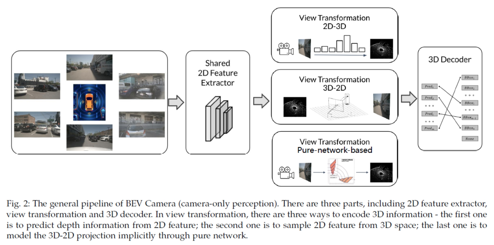

# BEV Camera Literature Survey

A general pipeline in BEV Camera.

- Lift, Splat, Shoot: Encoding Images from Arbitrary Camera Rigs by Implicitly Unprojecting to 3D / [paper](https://arxiv.org/pdf/2008.05711.pdf) / [project](https://github.com/nv-tlabs/lift-splat-shoot) / ECCV 2020 / LSS 
- BEVDet: High-performance Multi-camera 3D Object Detection in Bird-Eye-View / [paper](https://arxiv.org/pdf/2112.11790.pdf) / [project](https://github.com/HuangJunJie2017/BEVDet) / arXiv / BEVDet
- BEVDet4D: Exploit Temporal Cues in Multi-camera 3D Object Detection / [paper](https://arxiv.org/pdf/2203.17054.pdf) / [project](https://github.com/HuangJunJie2017/BEVDet) / arXiv / BEVDet4D
- BEVDepth: Acquisition of Reliable Depth for Multi-view 3D Object Detection / [paper](https://arxiv.org/pdf/2206.10092.pdf) / [project](https://github.com/Megvii-BaseDetection/BEVDepth) / arXiv / BEVDepth
- DSGN: Deep Stereo Geometry Network for 3D Object Detection / [paper](https://openaccess.thecvf.com/content_CVPR_2020/papers/Chen_DSGN_Deep_Stereo_Geometry_Network_for_3D_Object_Detection_CVPR_2020_paper.pdf) / [supplemental](https://openaccess.thecvf.com/content_CVPR_2020/supplemental/Chen_DSGN_Deep_Stereo_CVPR_2020_supplemental.pdf) / [project](https://github.com/dvlab-research/DSGN) / CVPR 2020
- LIGA-Stereo: Learning LiDAR Geometry Aware Representations for Stereo-Based 3D Detector / [paper](https://openaccess.thecvf.com/content/ICCV2021/papers/Guo_LIGA-Stereo_Learning_LiDAR_Geometry_Aware_Representations_for_Stereo-Based_3D_Detector_ICCV_2021_paper.pdf) / [supplemental](https://openaccess.thecvf.com/content/ICCV2021/supplemental/Guo_LIGA-Stereo_Learning_LiDAR_ICCV_2021_supplemental.pdf) / [project](https://github.com/xy-guo/LIGA-Stereo) / ICCV 2021
- Is Pseudo-Lidar Needed for Monocular 3D Object Detection? / [paper](https://openaccess.thecvf.com/content/ICCV2021/papers/Park_Is_Pseudo-Lidar_Needed_for_Monocular_3D_Object_Detection_ICCV_2021_paper.pdf) / [supplemental](https://openaccess.thecvf.com/content/ICCV2021/supplemental/Park_Is_Pseudo-Lidar_Needed_ICCV_2021_supplemental.pdf ) / [project](https://github.com/TRI-ML/dd3d) / ICCV 2021
- Inverse perspective mapping simplifies optical flow computation and obstacle detection / [paper](https://www.researchgate.net/profile/Hanspeter-Mallot/publication/21152139_Inverse_Perspective_Mapping_Simplifies_Optical_Flow_Computation_and_Obstacle_Detection/links/55408db60cf2736761c27d7f/Inverse-Perspective-Mapping-Simplifies-Optical-Flow-Computation-and-Obstacle-Detection.pdf) / ? / IPM
- Deep Learning based Vehicle Position and Orientation Estimation via Inverse Perspective Mapping Image / [paper](https://ieeexplore.ieee.org/stamp/stamp.jsp?arnumber=8814050&casa_token=Y7w2ksdBczAAAAAA:Z4Gh5YrhXaWoErbfoSr8dF6ZC2cFinJxk4dKA-tygE4UyOXfo4UmNVprsWpf0aum1VHTRBvwdX8t9HQ&tag=1) / IV 2019
- Learning to Map Vehicles into Bird’s Eye View / ICIAP 2017
- Monocular 3D Vehicle Detection Using Uncalibrated Traffic Cameras through Homography / [paper](https://ieeexplore.ieee.org/stamp/stamp.jsp?arnumber=9636384&casa_token=qJ5s2YQPfkYAAAAA:ryLgHGme1vTz6mWoKV9ToSbJ_lmGbeCL1oWMTc9EoIwnlCMT36QwRwByEcPKrH9ZQ76CsJQf0OxMScI) / IROS 2021
- Driving Among Flatmobiles: Bird-Eye-View Occupancy Grids From a Monocular Camera for Holistic Trajectory Planning / [paper](https://openaccess.thecvf.com/content/WACV2021/papers/Loukkal_Driving_Among_Flatmobiles_Bird-Eye-View_Occupancy_Grids_From_a_Monocular_Camera_WACV_2021_paper.pdf) /  WACV 2021
- Understanding Bird’s-Eye View of Road Semantics Using an Onboard Camera / [paper](https://ieeexplore.ieee.org/stamp/stamp.jsp?tp=&arnumber=9697426) / [project](https://github.com/ybarancan/BEV_feat_stitch) / IEEE ROBOTICS AND AUTOMATION LETTERS 2022
- Automatic dense visual semantic mapping from street-level imagery / [paper](https://ieeexplore.ieee.org/stamp/stamp.jsp?tp=&arnumber=6385958) / IEEE/RSJ International Conference on Intelligent Robots and Systems 2012
- Stacked Homography Transformations for Multi-View Pedestrian Detection / [paper](https://openaccess.thecvf.com/content/ICCV2021/papers/Song_Stacked_Homography_Transformations_for_Multi-View_Pedestrian_Detection_ICCV_2021_paper.pdf) / ICCV 2021
- Cross-View Semantic Segmentation for Sensing Surroundings / [paper](https://ieeexplore.ieee.org/stamp/stamp.jsp?tp=&arnumber=9123682) / [project](https://github.com/pbw-Berwin/View-Parsing-Network) / IEEE Robotics and Automation Letters 2020
- FISHING Net: Future Inference of Semantic Heatmaps In Grids / [paper](https://arxiv.org/pdf/2006.09917.pdf) / arXiv
- NEAT: Neural Attention Fields for End-to-End Autonomous Driving / [paper](https://openaccess.thecvf.com/content/ICCV2021/papers/Chitta_NEAT_Neural_Attention_Fields_for_End-to-End_Autonomous_Driving_ICCV_2021_paper.pdf) / [project](https://github.com/autonomousvision/neat) / ICCV 2021
- Projecting Your View Attentively: Monocular Road Scene Layout Estimation via Cross-View Transformation / [paper](https://openaccess.thecvf.com/content/CVPR2021/papers/Yang_Projecting_Your_View_Attentively_Monocular_Road_Scene_Layout_Estimation_via_CVPR_2021_paper.pdf) / [project](https://github.com/JonDoe-297/cross-view) / CVPR 2021
- Bird’s-Eye-View Panoptic Segmentation Using Monocular Frontal View Images / [paper](https://ieeexplore.ieee.org/stamp/stamp.jsp?tp=&arnumber=9681287) / [project](https://github.com/robot-learning-freiburg/PanopticBEV) / IEEE Robotics and Automation Letters 2022
- BEVFormer: Learning Bird's-Eye-View Representation from Multi-Camera Images via Spatiotemporal Transformers / [paper](https://arxiv.org/pdf/2203.17270.pdf) / [project](https://github.com/zhiqi-li/BEVFormer) / ECCV 2022
- PersFormer: 3D Lane Detection via Perspective Transformer and the OpenLane Benchmark / [paper](https://arxiv.org/pdf/2203.11089.pdf) / [project](https://github.com/OpenPerceptionX/PersFormer_3DLane) / ECCV 2022
- PETR: Position Embedding Transformation for Multi-View 3D Object Detection / [paper](https://arxiv.org/pdf/2203.05625.pdf) / [project](https://github.com/megvii-research/PETR) / ECCV 2022
- DETR3D: 3D Object Detection from Multi-view Images via 3D-to-2D Queries / [paper](https://proceedings.mlr.press/v164/wang22b/wang22b.pdf) / [project](https://github.com/WangYueFt/detr3d) / PMLR 2022
- Translating Images into Maps / [paper](https://ieeexplore.ieee.org/stamp/stamp.jsp?tp=&arnumber=9811901) / [project](https://github.com/avishkarsaha/translating-images-into-maps) / ICRA 2022
- GitNet: Geometric Prior-based Transformation for Birds-Eye-View Segmentation / [paper](https://arxiv.org/pdf/2204.07733.pdf) / ECCV 2022
- PETRv2: A Unified Framework for 3D Perception from Multi-Camera Images / [paper](https://arxiv.org/pdf/2206.01256.pdf) / [project](https://github.com/megvii-research/PETR) / arXiv
- ImVoxelNet: Image to Voxels Projection for Monocular and Multi-View General-Purpose 3D Object Detection / [paper](https://openaccess.thecvf.com/content/WACV2022/papers/Rukhovich_ImVoxelNet_Image_to_Voxels_Projection_for_Monocular_and_Multi-View_General-Purpose_WACV_2022_paper.pdf) / [supplemental](https://openaccess.thecvf.com/content/WACV2022/supplemental/Rukhovich_ImVoxelNet_Image_to_WACV_2022_supplemental.pdf) / [project](https://github.com/saic-vul/imvoxelnet) / WACV 2022
- MV-FCOS3D++: Multi-View Camera-Only 4D Object Detection with Pretrained Monocular Backbones / [paper](https://arxiv.org/pdf/2207.12716.pdf) / [project](https://github.com/Tai-Wang/Depth-from-Motion) / arXiv
- FIERY: Future Instance Prediction in Bird's-Eye View From Surround Monocular Cameras / [paper](https://openaccess.thecvf.com/content/ICCV2021/papers/Hu_FIERY_Future_Instance_Prediction_in_Birds-Eye_View_From_Surround_Monocular_ICCV_2021_paper.pdf) / [supplemental](https://openaccess.thecvf.com/content/ICCV2021/supplemental/Hu_FIERY_Future_Instance_ICCV_2021_supplemental.pdf) / [paper](https://github.com/wayveai/fiery) / ICCV 2021
- BEVerse: Unified Perception and Prediction in Birds-Eye-View for Vision-Centric Autonomous Driving / [paper](https://arxiv.org/pdf/2205.09743.pdf) / [project](https://github.com/zhangyp15/BEVerse) / arXiv
- LaRa: Latents and Rays for Multi-Camera Bird's-Eye-View Semantic Segmentation / [paper](https://arxiv.org/abs/2206.13294) / [project](https://valeoai.github.io/blog/publications/lara/) / [code](https://github.com/valeoai/LaRa) / CoRL 2022 / LaRa
- HDMapNet: An Online HD Map Construction and Evaluation Framework / [paper](https://arxiv.org/abs/2107.06307) / [project](https://tsinghua-mars-lab.github.io/HDMapNet/) / [code](https://github.com/Tsinghua-MARS-Lab/HDMapNet) / ICRA 2022 
- BEVSegFormer: Bird's Eye View Semantic Segmentation From Arbitrary Camera Rigs / [paper](https://openaccess.thecvf.com/content/WACV2023/html/Peng_BEVSegFormer_Birds_Eye_View_Semantic_Segmentation_From_Arbitrary_Camera_Rigs_WACV_2023_paper.html) / WACV 2023
- Cross-view Transformers for real-time Map-view Semantic Segmentation / [paper](https://openaccess.thecvf.com/content/CVPR2022/html/Zhou_Cross-View_Transformers_for_Real-Time_Map-View_Semantic_Segmentation_CVPR_2022_paper.html) / [code](https://github.com/bradyz/cross_view_transformers) / CVPR 2022