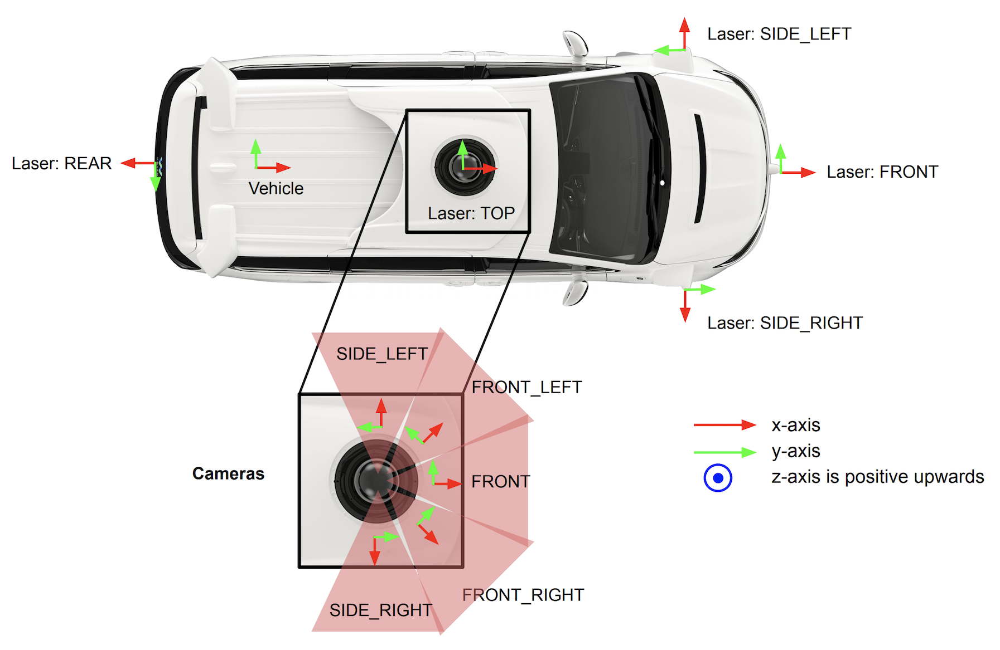

# Example

## Coordinate system

Currently, we follow the coordinate system of Waymo Open Dataset.

The ego-vehicle coordinate system is right handed and the x-axis points forward. The origin is at the rear of the car. For more details, please refer to https://waymo.com/open/data/perception/

## Visualization

We provide some visualization for our data augmentation strategies.

**Random Scale**

**Random horizontal Flip**