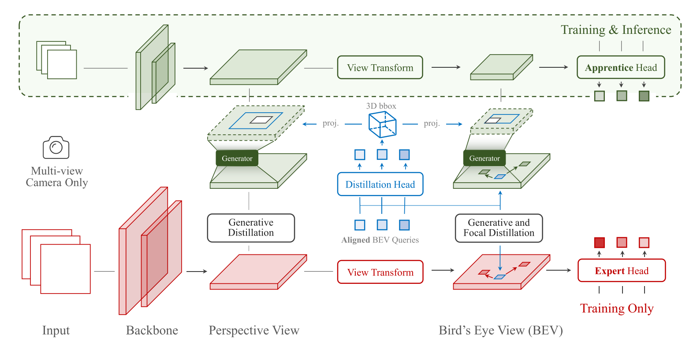

## FocalDistiller
> This repository is the official implementation of the CVPR 2023 paper ["Distilling Focal Knowledge from Imperfect Expert for 3D object Detection"](https://openaccess.thecvf.com/content/CVPR2023/html/Zeng_Distilling_Focal_Knowledge_From_Imperfect_Expert_for_3D_Object_Detection_CVPR_2023_paper.html). 
>
> Authors: [Jia Zeng](https://scholar.google.com/citations?hl=zh-CN&user=kYrUfMoAAAAJ), [Li Chen](https://scholar.google.com/citations?user=ulZxvY0AAAAJ&hl=en&authuser=1), Hanming Deng, Lewei Lu, Junchi Yan, Yu Qiao, [Hongyang Li](https://lihongyang.info/)

### Abstract

Multi-camera 3D object detection blossoms in recent years and most of state-of-the-art methods are built up on the bird's-eye-view (BEV) representations. Albeit remarkable performance, these works suffer from low efficiency. Typically, knowledge distillation can be used for model compression. However, due to unclear 3D geometry reasoning, expert features usually contain some noisy and confusing areas. In this work, we investigate on how to distill the knowledge from an imperfect expert. We propose FD3D, a Focal Distiller for 3D object detection. Specifically, a set of queries are leveraged to locate the instance-level areas for masked feature generation, to intensify feature representation ability in these areas. Moreover, these queries search out the representative fine-grained positions for refined distillation. We verify the effectiveness of our method by applying it to two popular detection models, BEVFormer and DETR3D. The results demonstrate that our method achieves improvements of 4.07 and 3.17 points respectively in terms of NDS metric on nuScenes benchmark. 

## Usage
### Installation
* Environment requirements:
```
torch==1.9.1+cu111 
torchvision==0.10.1+cu111 
torchaudio==0.9.1
omgarcia
gcc-6
mmcv-full==1.4.0
mmdet==2.14.0
mmsegmentation==0.14.1
mmdet3d==0.17.1
```
* We recommend you to follow the guide of [BEVFormer](https://github.com/fundamentalvision/BEVFormer) for environment configuration and dataset preparation.
* Clone the repo [Birds-eye-view-Perception](https://github.com/OpenDriveLab/Birds-eye-view-Perception.git) and move **nuScenes_playground/FocalDistiller** under **mmdetection3d**.
* Download the required [weights](https://drive.google.com/drive/folders/1h2XHWVJ7SkClRpgk2nANOVj6k_Ywglel?usp=sharing) and put them into folder **FocalDistiller/ckpts**

### Training
For training a teacher network or student network, run the script **tools/dist_train.sh**. For instance:
```
# train network bevformer(base version)
tools/dist_train.sh ./projects/configs/bevformer/bevformer_base.py 8

# train network bevformer(small version)
tools/dist_train.sh ./projects/configs/bevformer/bevformer_small.py 8
```
### Evaluation
For validating a teacher network or student network, run the script **tools/test.py**. For instance:
```
# test network bevformer(base version)
PYTHONPATH=".":$PYTHONPATH python -m torch.distributed.launch --nproc_per_node=1 tools/test.py projects/configs/bevformer/bevformer_base.py  ckpts/bevformer_r101_dcn_24ep.pth --launcher pytorch --eval bbox

# test network bevformer(small version)
PYTHONPATH=".":$PYTHONPATH python -m torch.distributed.launch --nproc_per_node=1  tools/test.py projects/configs/bevformer/bevformer_small.py ckpts/bevformer_small_ep24.pth --launcher pytorch --eval bbox 
```

### Knowlwedge distillation
For knowledge transfer between teacher and student networks, run the script **tools/dist_distill.sh**. For instance:
```
./tools/dist_distill.sh projects/configs/distiller/base_distill_small_with_pv-cwd_bev-l2-heatmap.py 8
```
For evaluating the student network after distillation, run the script **tools/testStu.py**. For instance:
```
PYTHONPATH=".":$PYTHONPATH python -m torch.distributed.launch --nproc_per_node=1 tools/testStu.py projects/configs/distiller/base_distill_small_with_pv-cwd_bev-l2-heatmap.py ckpts/base_distill_small_with_pv-cwd_bev-l2-heatmap_ep24.pth --launcher pytorch --eval bbox
```

### Main results

Models and results under main metrics are provided below.

| Method | Back-bone | Image Res. | BEV Res. | NDS | mAP | GFLOPS | FPS | Config | ckpt |
| :---: | :---: | :---: | :---: | :---:|:---:| :---: | :---: | :---: | :---: |
| BEVFormer-Base (T) | R101-DCN | 900x1600 | 200x200 | 51.76  | 41.66 | 1323.41 | 1.8 | [config](nuScenes_playground\FocalDistiller\projects\configs\bevformer\bevformer_base.py) | [weight](https://drive.google.com/file/d/1-QwiDW_IXisCO3JFnrjyB6ukeffQuhYB/view?usp=drive_link) |
| BEVFormer-Small (S)  | R101-DCN  | 450x800  | 100x100 | 46.83 | 35.09 | 416.46  | 5.9  | [config](nuScenes_playground\FocalDistiller\projects\configs\bevformer\bevformer_small.py) | [weight](https://drive.google.com/file/d/1ClTyExB5tBRfnmEC6EY73q5SKdeO5U8p/view?usp=drive_link) |
| + HeatmapDistiller   | R101-DCN  | 450x800  | 100x100 | 48.98 | 37.27 | 416.46  | 5.9  | [config](nuScenes_playground\FocalDistiller\projects\configs\distiller\base_distill_small_with_pv-cwd_bev-l2-heatmap.py) | [weight](https://drive.google.com/file/d/1wqDrnlfCHy4Fexilmo2C-kERZaNm0jAM/view?usp=drive_link) |

* The metric FPS is measure on RTX 2080Ti. 

### TODO list

- [x] Codebase for knowledge distillation in BEV perception
- [ ] release implementation of FocalDistiller (BEVFormer)
- [ ] release implementation of FocalDistiller (DETR3D, BEVDepth, 2D detection models)

## License

All assets and code are under the [Apache 2.0 license](../LICENSE) unless specified otherwise.

## Citation

Please consider citing our paper if the project helps your research with the following BibTex:

```bibtex
@inproceedings{zeng2023distilling,
  title={Distilling Focal Knowledge from Imperfect Expert for 3D Object Detection},
  author={Zeng, Jia and Chen, Li and Deng, Hanming and Lu, Lewei and Yan, Junchi and Qiao, Yu and Li, Hongyang},
  booktitle={Proceedings of the IEEE/CVF Conference on Computer Vision and Pattern Recognition},
  year={2023}
}
```
## Acknowledgement

[](https://awesome.re)

- [mmdet3d](https://github.com/open-mmlab/mmdetection3d)
- [BEVFormer](https://github.com/fundamentalvision/BEVFormer)
- [BEVDet](https://github.com/HuangJunJie2017/BEVDet)
- [DETR3D](https://github.com/WangYueFt/detr3d)